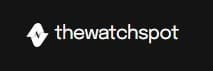
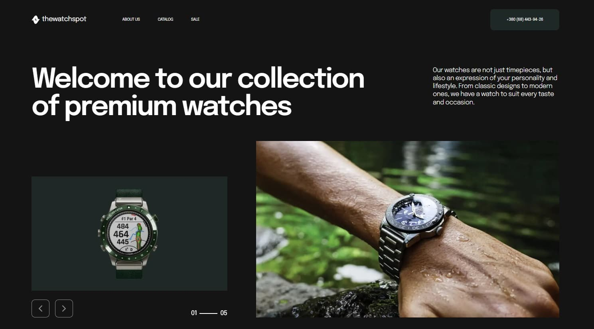
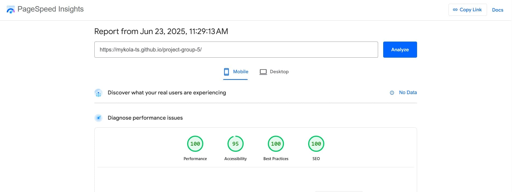
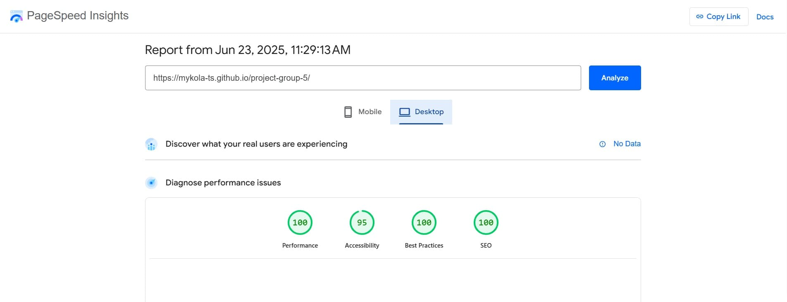

# TheWatchSpot

Discover our premium collection of men's watches combining Swiss craftsmanship,
modern design, and precision. Find your perfect timepiece today.



## About the Project

This project is a responsive single-page website developed for the
**TheWatchSpot** brand. It showcases featured products, highlights promotional
offers, and allows users to add items to favorites using localStorage. The
design is clean, modern, and mobile-friendly, providing a smooth user
experience.



### Website Structure

The site consists of the following main sections:

- **Header** — contains the site logo, a navigation menu linking to key sections
  and a clickable phone number link that allows users to initiate a call
  directly from mobile devices;
- **Hero** — a visually engaging section that featuring a welcoming headline, a
  featured banner image, a brief brand message about style and personality, and
  an image slider displaying various watch models;
- **About Us** — introduces the brand’s philosophy and values through
  descriptive text, emphasizing luxury, precision, and personal expression. The
  section includes a short promotional video to visually reinforce the brand’s
  identity and craftsmanship;
- **Catalog** — displays a selection of watch products in a responsive grid
  layout. Each card includes an image, product title, and an “add to favorites”
  button. When hovered, the card reveals a short product description, enhancing
  interactivity and user engagement. At the bottom of the section, a prominent
  “Buy now” button opens a modal form for placing an order.
- **New Watches** — highlights a featured product collection with large,
  visually striking images that emphasize the design and elegance of the latest
  models. The section draws attention to new arrivals and supports visual
  storytelling through high-quality photography;
- **Sale** — highlights a special promotional product with an option to view
  more details and toggle description visibility;
- **Footer** — additional navigation, contact details, social media links, and
  legal information including copyright and policy links.
- **Buy Now** - a modal window with information about the product and a form for
  placing an order.

## Useful Links

[Live Demo](https://mykola-ts.github.io/project-group-5/) — deployed version of
the website

[GitHub Repository](https://github.com/Mykola-Ts/project-group-5) — deployed
version of the website

[Figma Design](https://www.figma.com/design/LZQvuv5IZCMW8bNjJDqT5j/The-Watch-Spot--Copy-?node-id=0-1&p=f&t=3GaPn7ly5UAXZ1vV-0)
— the project’s UI/UX design mockup

## Technologies Used

- HTML5
- CSS3
- JavaScript (ES6+)
- Vite — modern frontend build tool
- Git / GitHub

## Libraries Used

- [Swiper.js](https://swiperjs.com/) — responsive, touch-friendly sliders
- [modern-normalize](https://github.com/sindresorhus/modern-normalize) — CSS
  normalization
- [vite-plugin-full-reload](https://www.npmjs.com/package/vite-plugin-full-reload)
  — hot reload for Vite
- [vite-plugin-html-inject](https://www.npmjs.com/package/vite-plugin-html-inject)
  — inject HTML variables during build

## Folder and File Structure

- **.github/**: GitHub-specific configuration and workflows.

- **assets/**: Folder stores images used in the README.md file to visually
  document and represent the project.

- **src/**: Folder contains the source code of the application, including all
  essential files such as HTML, CSS, JavaScript, and component logic used to
  build and structure the project:

  - **css/**: CSS files for each section of the site.

  - **fonts/**: Custom fonts used in the project.

  - **img/**: Folder for images and icons used throughout the site.

  - **js/**: Contains JavaScript files for functionality.

  - **partials/**: HTML partials for each section of the site.

  - **public/**: Static assets for Vite (e.g., images, favicons, etc.).

  - **index.html**: The main HTML file for the site.

  - **main.js**: This JavaScript entry file imports and initializes various
    modules that handle the interactive functionality of the website.

- **.editorconfig**: Editor configuration file.

- **.gitignore**: Specifies which files and directories to ignore in Git.

- **.prettierrc.json**: Prettier configuration for code formatting.

- **package.json**: Contains metadata about the project and dependencies.

- **README.md**: Project documentation and setup instructions.

- **vite.config.js**: Configuration file for Vite.

## Features

- **Responsive Design**  
  Website adapts to different screen sizes: desktop, tablet, and mobile.

- **Mobile Menu**  
  Slide-in mobile navigation menu with backdrop and proper event handling. Menu
  automatically closes when clicking on a nav-link or on the close button.

- **Swiper Slider Integration**  
  Image slider implemented using Swiper.js with adaptive behavior depending on
  the screen width.

- **Keyboard Accessibility**  
  Modal window and navigation elements are accessible via keyboard (e.g. Esc to
  close modals).

- **Clean & Modular Code**  
  Code is split into logical modules.

- **Lightweight & Fast**  
  Optimized for performance with lazy-loaded scripts and minimal CSS overhead.

## PageSpeed Results

Google's PageSpeed Insights was used to analyze the performance of the
TheWatchSpot website on both mobile and desktop devices. The results highlight
strong performance across various categories, ensuring a smooth user experience.

**Mobile Performance:**



**Desktop Performance:**



These results demonstrate that the website is optimized for both performance and
user experience, ensuring fast loading times and high usability on all devices.

## Installation & Setup

To run the project locally, follow these steps:

1. **Clone the repository**
   ```bash
   git clone https://github.com/Mykola-Ts/project-group-5.git
   cd project-group-5
   ```
2. **Install dependencies**

   ```bash
    npm install
   ```

3. **Start the development server**

   ```bash
    npm run dev
   ```

4. **Open in browser**

Visit http://localhost:5173/ to view the project.

## Authors

- **Mykola Tsybulskyi** (Team Lead + Hero section)

  - GitHub https://github.com/Mykola-Ts

  - Email tsybulskiyk@gmail.com

  - LinkedIn https://www.linkedin.com/in/mykola-tsybulskyi

- **Oleksandr Grogul** (Scrum Master + Buy Now section)

  - GitHub https://github.com/groguls

  - Email groguls@gmail.com

- **Serhii Korchma** (Footer section)

  - GitHub https://github.com/pro100ergeyko

  - Email serg.korchma@gmail.com

- **Oleksandr Nelepa** (Catalog section)

  - GitHub https://github.com/OleksandrNelepa

  - Email sasha.nelepa96@gmail.com

- **Maryna Udovychenko** (About Us section)

  - GitHub https://github.com/Marini23

  - Email marina.smile1m@gmail.com

- **Oksana Piven** (Sale section)

  - GitHub https://github.com/oksana-oxy

  - Email pivenoxana143@gmail.com

- **Kyrylo** (New Watches section)

  - GitHub https://github.com/Kyrylo2002
